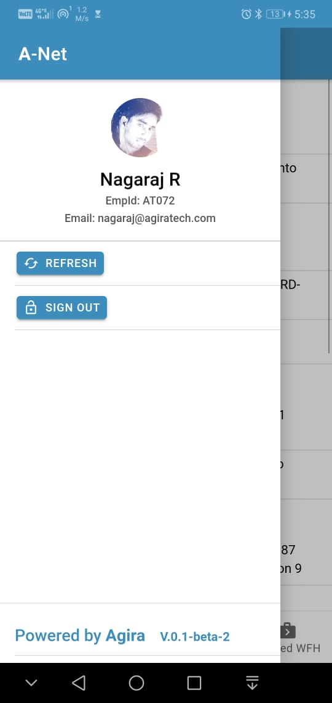
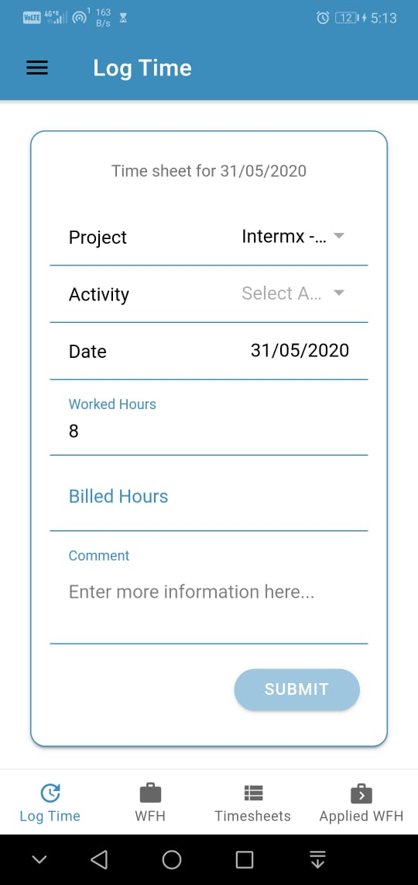
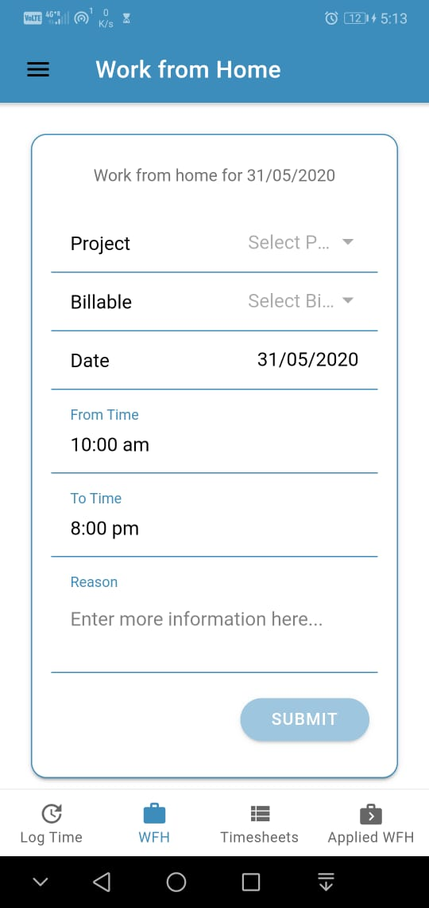
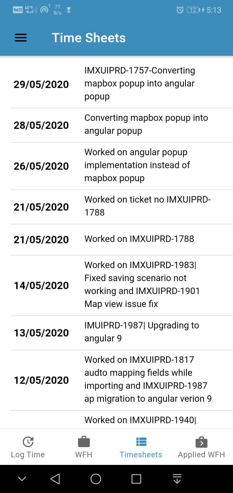
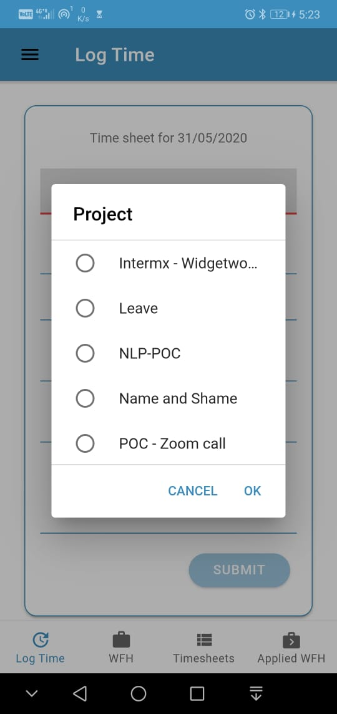
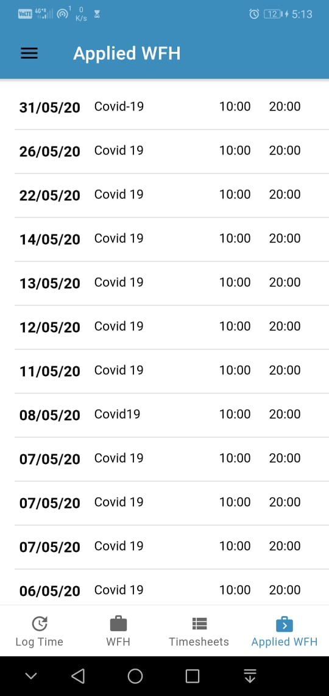

# Anet Hybrid mobile app
 ###### Un official Anet mobile application
  
## Built on
    1. Angular - V9
    2. Ionic - V5
    3. NGRX - V9
    4. Capacitor - V2

## Run 

     ionic serve

## Run in android studio to build
    ionic cap run android --prod
  
## Download
  APK available in this repo `anet-v.0.1-beta-2.1.apk`

### Screenshots

<Rows>
  
  
  
  
  
  
  
  
  
  
<Rows/>
